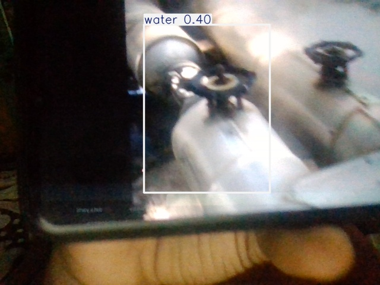

# 🛠️ Automated Integrity Assessment and Defect Detection Using Deep Learning

- Ensuring the integrity of pipelines is paramount for the safe and efficient transportation of fluids across vast networks. Traditional manual inspection methods are often labour-intensive, time-consuming, and prone to human error. In recent years, advances in computer vision and machine learning have enabled the development of automated pipeline inspection systems using object detection models. This project presents a comprehensive overview of the process involved in automating pipeline integrity assessment through the use of object detection models. The pipeline inspection workflow begins with the collection of visual data using drones, cameras, or specialized robots equipped with imaging sensors. Preprocessing techniques are then applied to enhance the quality of the collected data. Annotated data, comprising labelled instances of anomalies such as cracks, corrosion, and dents, is used to train object detection models. Popular architecture such as YOLO, is employed to detect and localize anomalies within the images.The trained model is evaluated to ensure robust performance in real-world scenarios. Upon deployment, the models analyse new visual data captured during pipeline inspections, identifying and classifying anomalies to provide actionable insights into the pipeline's condition. Alerts and reports are generated based on the severity and location of detected anomalies, enabling timely maintenance interventions to prevent failures and ensure safety.

---

## 📂 Materials /Software Used for Implementation:

### HARDWARE REQUIREMENT

-	Processor        		: Intel core processor 2.6.0 GHZ
-	RAM 			: 1GB
-	Hard disk        		: 160 GB
-	Compact Disk 		: 650 Mb
-	Keyboard        		: Standard keyboard
-	Monitor           	           :15-inch color monitor

### SOFTWARE REQUIREMENT

- Server Side 			: Python 3.7.4(64-bit) or (32-bit) 
- Client Side			: HTML, CSS, Bootstrap 
-	 IDE            			: Flask 1.1.1 
-	 Back end    			: MySQL 5. 
-	 Server     			: WampServer 2i
-	 OS           			: Windows 10 64 –bit

---

## 📌 Features

- ⚙️ **Automated defect detection** using CNNs (e.g., ResNet, YOLO, UNet)
- 📸 **Image segmentation and classification** of structural anomalies
- 🧠 Transfer learning support for faster convergence
- 📈 Integrated training, validation, and evaluation pipelines
- 📊 Metrics reporting: Accuracy, Precision, Recall, IoU, mAP
- ✅ Easy inference with visualization overlays
- 📁 Custom dataset support

---
## Architecture Diagram

  

---

## Feasibility for Product Making:

### 1. Technical Feasibility

- The core technology for pipeline defect detection—computer vision combined with deep learning—has matured significantly in recent years. With access to frameworks like TensorFlow, PyTorch, and models such as CNNs and YOLO, the development of an accurate and efficient detection system is achievable. High-resolution cameras and drone technology can be used for real-time data collection, and edge computing devices can process data on-site, enabling real-time analysis. The modularity of AI models also allows the system to be easily updated and adapted to new types of defects or environments.
 
### 2. Economic Feasibility

- From a cost perspective, the project remains economically viable. Open-source software reduces licensing costs, and hardware such as cameras, drones, and computing devices are now more affordable than ever. The initial investment in development and training is outweighed by long-term savings from reduced manual inspection costs and early defect detection, which minimizes repair expenses and operational downtime.

### 3.Market Feasibility

- There is a strong market demand for intelligent infrastructure monitoring systems, especially in industries such as oil & gas, water utilities, and energy. Companies are increasingly investing in predictive maintenance to enhance safety, reduce operational risks, and comply with regulatory standards. The proposed product aligns with these trends, offering a scalable, efficient, and user-friendly solution. Its ability to integrate with existing workflows also adds to its commercial attractiveness.

---

## 📷 Sample Outputs

  

---

## 🧪 Models Used

- **Classification**: ResNet50, EfficientNet
- **Object Detection**: YOLOv5, Faster R-CNN
- **Segmentation**: UNet, DeepLabv3+

---

## ⚙️ Setup Instructions

### 1. Clone the Repository

git clone https://github.com/Yogesh04591/Pipeline-defect-detection.git 
cd Pipeline-Defect-detection

### 2. Create a Virtual Environment
python -m venv venv
source venv/bin/activate  # On Windows: venv\Scripts\activate

### 3. Download and Prepare the Dataset

if __name__ == "__main__": 
    from ultralytics import YOLO 
    model = YOLO('yolo11n.pt') 
    model.train(data='datasets/data.yaml', epochs=20, imgsz=440, batch=8, amp=True) 

---

## 🚀 Running the Project

### 1. Training a Model
Copy 
Edit 
python src/train.py --config config.yaml

### 2. Running Inference
Copy 
Edit 
python src/predict.py --image data/test/sample.jpg

### 3. Evaluation
Copy 
Edit 
python src/evaluate.py

---

## ⚙️ Configuration File (config.yaml)

 train: ../train/images 
 val: ../valid/images 
 test: ../test/images 
 nc: 3 
 names: ['crack', 'gas', 'water'] 
 roboflow: 
workspace: zbxxx 
    project: pipe-leak 
    version: 1 
    license: CC BY 4.0 
    url: https://universe.roboflow.com/zbxxx/pipe-leak/dataset/1 

---

## 🧾 Install Via
- Python 3.8+
- PyTorch
- OpenCV
- torchvision
- matplotlib
- albumentations
- scikit-learn
- tqdm
- pandas

---

## Outcomes:

- The pipeline defect detection project culminated in the successful development of an intelligent system capable of automatically identifying and classifying defects such as cracks, corrosion, and leaks in pipeline infrastructure. Leveraging deep learning techniques, particularly convolutional neural networks (CNNs), the model was trained on a curated dataset of pipeline images and demonstrated high accuracy, precision, and recall in detecting various defect types. Data augmentation and preprocessing significantly enhanced the robustness of the system, allowing it to generalize well across different conditions. The project also involved benchmarking the automated system against traditional manual inspection methods, highlighting a notable improvement in both efficiency and accuracy. Additionally, a user-friendly interface was developed to facilitate easy input and visualization of predictions, making the tool practical for field applications. Overall, the project showcases the potential of AI-powered solutions in transforming pipeline maintenance and safety operations.

---

## 📊 Evaluation Metrics
- Accuracy = 95.6
- Precision / Recall = 92.7
- Mean Average Precision (mAP) = 98.1
- F1 Score = 89.1

---

## 📚 References

-  Zuo, Zhonglin, et al. “Leak detection for natural gas gathering pipelines under multiple operating conditions using RP-1dConvLSTM-AE and multimodel decision.” IEEE Transactions on Industrial Electronics (2023).
-  Gemeinhardt, Hayden, and Jyotsna Sharma. “Machine Learning-Assisted Leak Detection using Distributed Temperature and Acoustic Sensors.” IEEE Sensors Journal (2023).
-  Rajasekaran, Uma, and Mohanaprasad Kothandaraman. “A Novel Custom One-Dimensional Time-Series DenseNet for Water Pipeline Leak Detection and Localization Using Acousto-Optic Sensor.” IEEE Access (2024).
-  Zhao, Yuxin, et al. “Video detection of small leaks in buried gas pipelines.” IEEE Access (2023).
-  Islam, Mohammed Rezwanul, et al. “An Intelligent IoT and ML-Based Water Leakage Detection System.” IEEE Access (2023).
-  Chen, Suisheng, et al. “Leak detection in water supply network Using a data-driven improved graph convolutional network.” IEEE Access (2023).
-  Dashdondov, Khongorzul, Mi-Hye Kim, and Kyuri Jo. “NDAMA: A novel deep autoencoder and multivariate analysis approach for IOT-based methane gas leakage detection.” IEEE Access (2023).
-  Liu, Song, et al. “Analysis of the Propagation Characteristics of Acoustic Waves from Leakages in Buried Gas Pipelines.” IEEE Access (2023).
-  Tao, Tao, et al. “Intelligent Urban Sensing for Gas Leakage Risk Assessment.” IEEE Access 11 (2023): 37900-37910.
-  Casas, Edmundo, et al. “An End-to-End Platform for Managing Third-party Risks in Oil Pipelines.” IEEE Access (2024).

---

##  Contact

For questions or support, please contact:
- **Name** : Yogesh M
- **Email** : yogeshm04591@gmail.com
- **github User Id** : Yogesh04591

---
